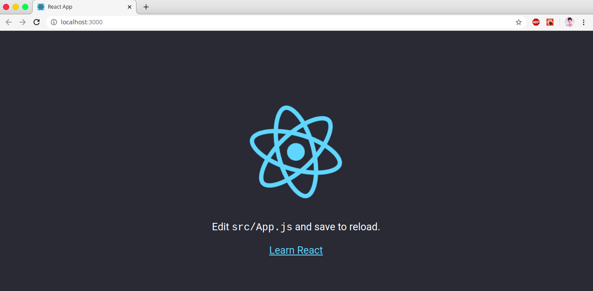
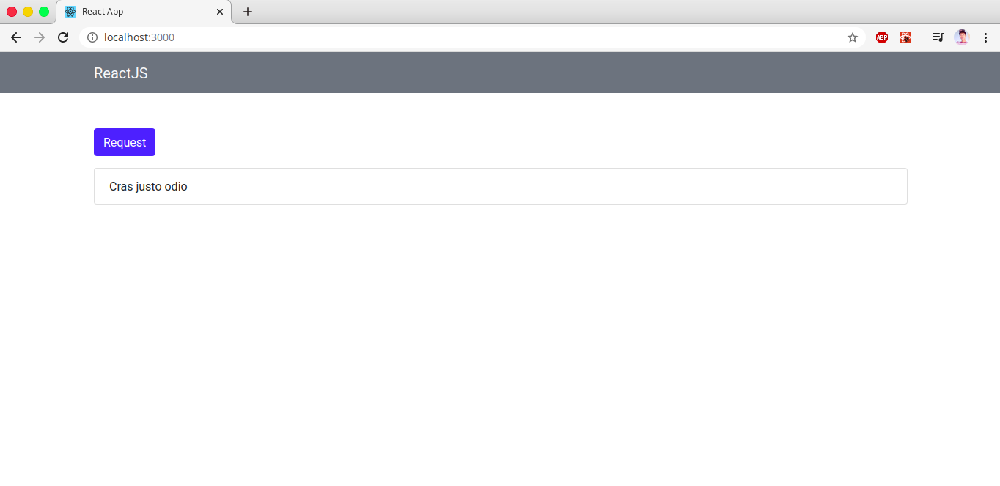
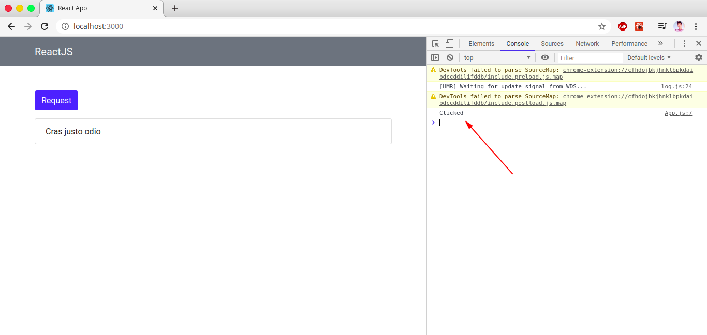
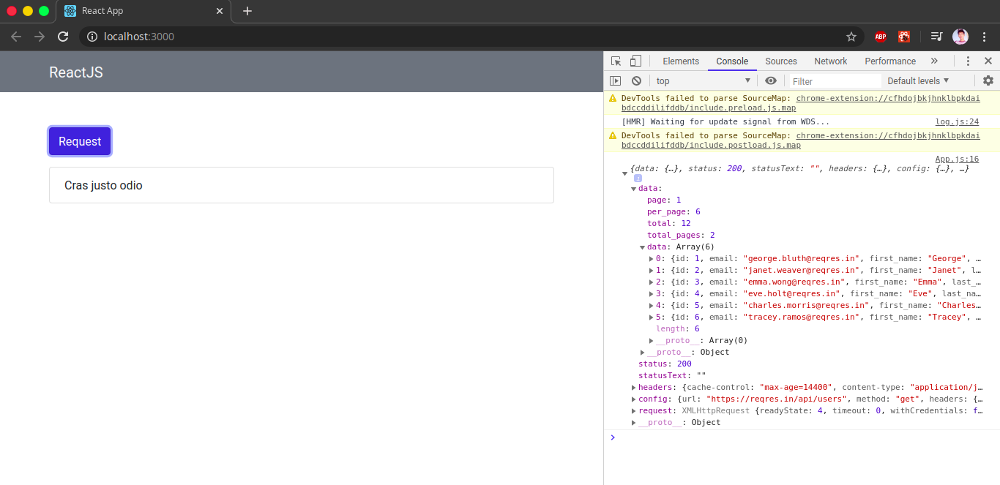
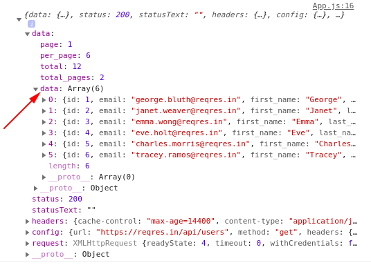
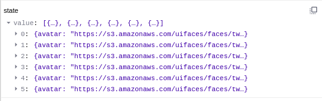
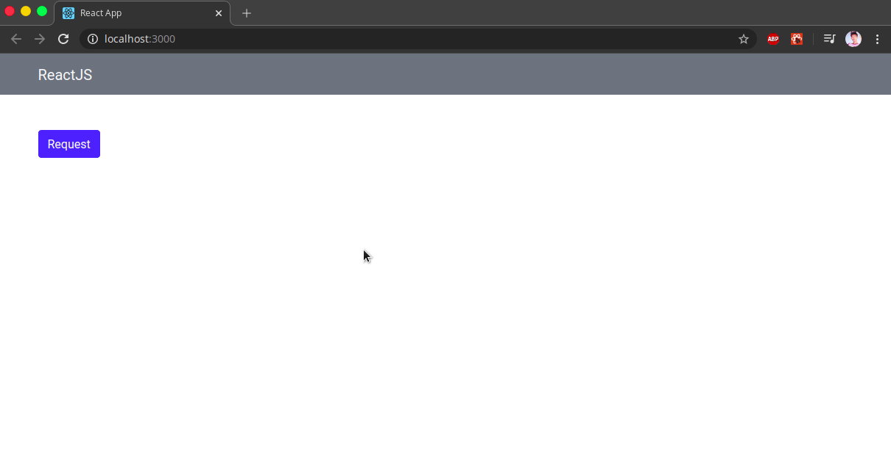

Kali ini kita akan membuat sebuah API Request menggunakan ReactJS dan Axios. Apa itu Axios?. Axios adalah library untuk melakukan HTTP Request yang akhir-akhir ini lagi populer.

Untuk API kita dapat menggunakan API kita sendiri yang sebelumnya pernah kita buat di tutorial sebelumnya [disini](http://me.iqbalpambudi.com/membuat-rest-api-menggunakan-nodejs-mongodb/). Namun kita akan menggunakan fake API dari situs [reqres.in](reqres.in) agar lebih mudah.

## Setup Project
Buat dulu project React dengan `create-react-app`
```
npx create-react-app reactaxios
```
<br/>Setelah itu masuk ke direktori `reactaxios` dan jalankan project React dengan `npm start` maka akan terlihat seperti berikut di browser


<center><small>Fig 1: ReactJS Starter</small></center>

## Membuat Layout
Kita akan membuat layout sederhana terlebih dulu menggunakan Bootstrap. Untuk dapat menggunakan Bootstrap kita install terlebih dahulu

```
npm install bootstrap
```

<br/>Kita akan membuat layout sederhana yang terdiri dari navbar, button dan list item. Buat file `App.js` seperti berikut

```
import React,{Component} from "react"
import "bootstrap/dist/css/bootstrap.min.css"

class App extends Component {
  render(){
    return (
      <div>
        <nav className="navbar navbar-light bg-secondary">
          <div className="container">
            <span className="navbar-brand text-light">ReactJS</span>
          </div>
        </nav>
  
        <div className="container mt-5">
        <button type="button" className="btn btn-primary mb-3">Request</button>
        <ul className="list-group">
          <li className="list-group-item">Cras justo odio</li>
        </ul>
        </div>
      </div>
    )
  }
}

export default App

```

<br/>Maka tampilan akan seperti berikut


<center><small>Fig 2: Layout</small></center>


## Membuat fungsi handleClick
Masih pada file `App.js` tambahkan sebuah fungsi _handleClick_ didalam class App (letakkan diatas method render() ). _handleClick_ digunakan untuk menangani button request ketika di klik.

```
handleClick = () => {
    console.log('Clicked!')
  }
```

<br/>Kemudian tambahkan atribut `onClick` pada button dan akan memanggil fungsi _handleClick_

```
<button type="button" className="btn btn-primary mb-3" onClick={this.handleClick}>Request</button>
```

<br/>Bila berhasil maka ketika button Request di klik maka akan tampil pesan "Clicked!" pada console


<center><small>Fig 3: handleClick</small></center>


## Membuat Request GET
Kita akan membuat sebuah API Request sederhana menggunakan Axios. Kita install terlebih dulu Axiosnya

```
npm install axios
```

<br/>Kita akan membuat sebuah state yang akan menampung value dari API Request kita. Caranya buat sebuah constructor didalam class App

```
constructor(){
  super()
  this.state = {
    value:[]
  }
}
```

<br/>Sekarang kita modifikasi fungsi handleClick agar dapat melakukan request API ke reqres.in. Buat fungsi handleClick seperti berikut

```
handleClick = () => {
    axios.get('https://reqres.in/api/users')
    .then(response => console.log(response))
  }
```

<br/>Maka hasilnya akan seperti berikut


<center><small>Fig 4: Axios GET</small></center>

## Menampilkan Data
Perhatikan gambar berikut


<center><small>Fig 5: Struktur Objek</small></center>

<br/>Kita akan mengambil data yang berada pada key `data` -> `data`. Sekarang kita akan menyimpan hasil request API kita ke state terlebih dahulu. Ubah fungsi handleClick seperti berikut

```
handleClick = () => {
    axios.get('https://reqres.in/api/users')
    .then(response => this.setState({value : response.data.data}))
  }
```

<br/>Setelah itu state `value` akan terlihat sebagai berikut ketika button Request di klik


<center><small>Fig 6: State value</small></center>

<br/>Setelah state `value` terisi dengan data API, kita akan menampilkannya dengan method `map()`. Pada List Group ubah seperti berikut

```
<ul className="list-group">
  {this.state.value.map((data, index) => (
    <li key={index} className="list-group-item">{data.first_name}</li>
  ))}
</ul>
```

<br/>Simpan dan jalankan maka akan terlihat seperti berikut


<center><small>Fig 7: Mapping Data</small></center>

<br/>Yey kita sudah berhasil melakukan request API dan menampilkannya kedalam web kita 🎉. Semoga bermanfaat 
