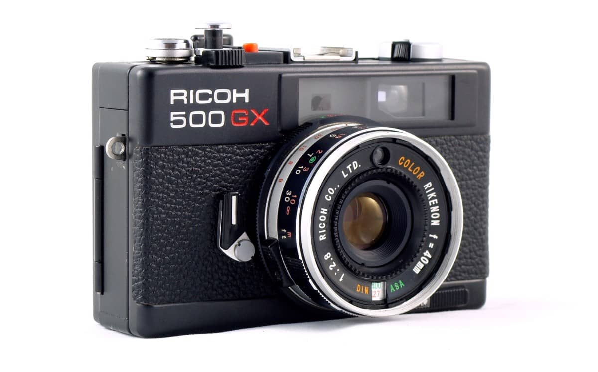
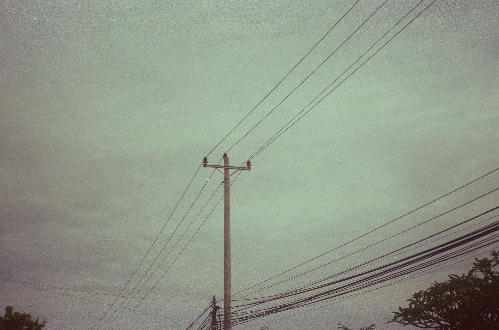
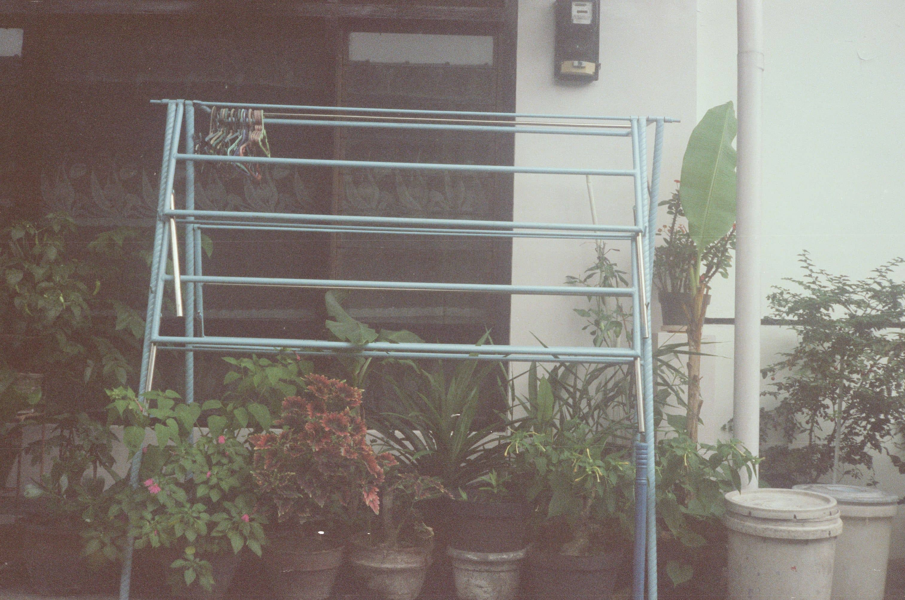
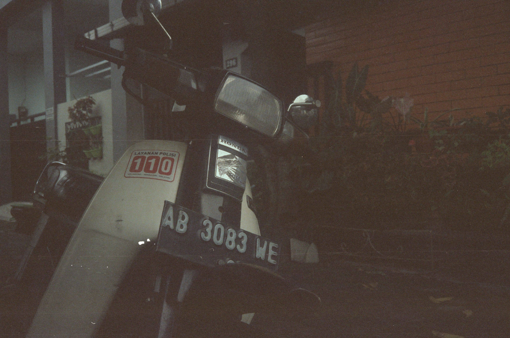
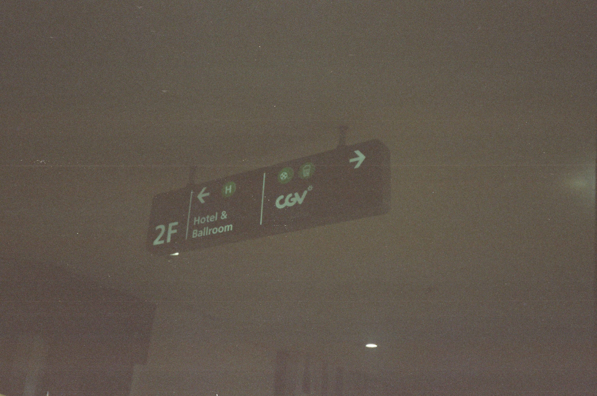
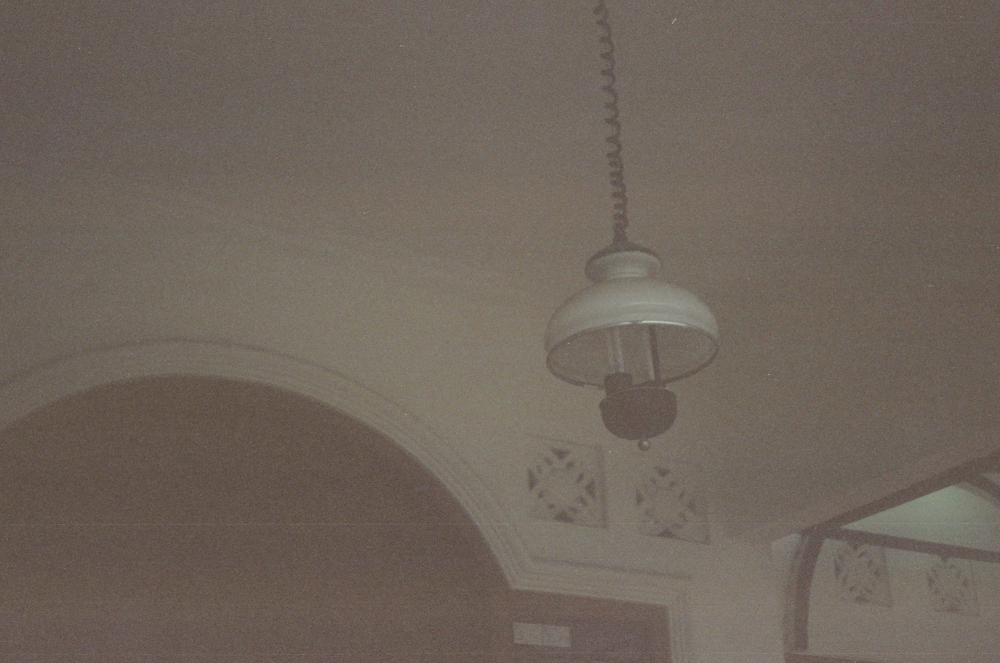

Beberapa waktu lalu saya membeli kamera analog dari Instagram. Saya membeli kamera tersebut karena terlihat hmmmm "antik dan klasik". 

Kamera yang saya beli yaitu Ricoh 500GX keluaran tahun 70an dengan film 35mm dan focal length 40mm. Semua normal cuma minusnya lightmeternya mati.

Sebenarnya saya mau beli yang Ricoh GX1 tapi stoknya habis dulu dan barangnya gaada yang baru alias barang bekas semua karena ya udah ga diproduksi lagi. 

<small>Ricoh 500gx</small>

 

## Kamera
Ricoh 500GX termasuk jenis kamera range finder. Saya memilih kamera range finder karena dapat dengan bebas ngatur exposure nya. Ada beberapa jenis kamera analog seperti kamera pocket, kamera SLR, TLR dll.

Kamera ini pas digenggaman, nggak terlalu kecil dan nggak terlalu besar dan juga cukup ringan buat dibawa hunting. 

Catnya agak mengelupas, ya mungkin karena faktor umur dari kamera ini yg juga udah lama jadi cukup wajar wajar aja sih, tinggal perawatannya aja dan biasanya kubersihin pake tisu dan alkohol.

## Film
Roll film pertama saya Kodak Vision 500T, saya beli dengan harga Rp35.000/Film dengan 36 exposure. Ya karena ada promo beli 3 Rp100.000 yaudah saya beli 3 sekalian, yang satu dibeli temen saya jadinya saya punya 2 film. 

Ini harga film paling murah diantara film yg lain. Fujicolor harganya bisa nyampe 100k per film euy. Karena ini percobaan film pertama ya saya pikir pake film murahan aja lah buat nyoba. 

dan ini beberapa hasilnya

 

 

 

 

 

Gelap ya??

Maklum masih amatiran, masih nyari setingan yang tepat. 

Oh iya hasil jepertan analog juga saya upload di Instagram. Kalo mau kepo langsung aja cuss ke [@analog_amatir](https://instagram.com/analog_amatir), siapa tau cocok hehe. 