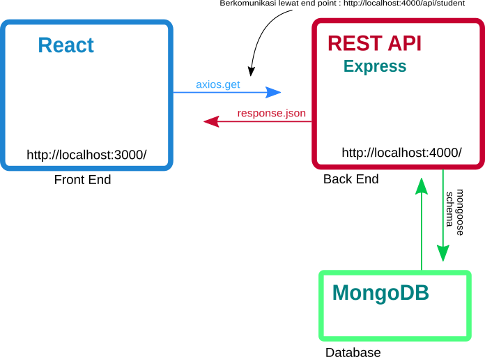
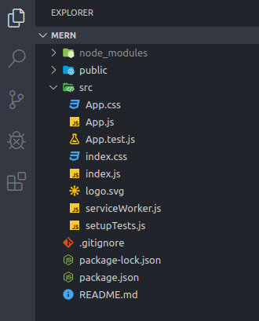
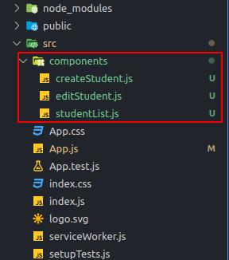

Halo, Belakangan ini saya belajar tentang Javascript. Salah satunya saya belajar tentang pembuatan REST API menggunakan Express dan MongoDB.

Sebelumnya saya juga sudah sedikit belajar tentang ReactJS. Nah ini saatnya menggabungkan antara Front End dan Backend. Jadilah MERN (MongoDB, Express, React, NodeJS).

## Mengenal Aplikasi MERN

**1. MongoDB**<br/>
MongoDB adalah salahsatu database yang berjenis NoSQL dan menggunakan data berjenis JSON. Untuk dokumentasi dan cara instalasinya dapat mengunjungi langsung pada website official [MongoDB](https://mongodb.com)

**2. Express**<br/>
Express merupakan framework populer yang berjalan diatas NodeJS. Express adalah framework untuk membangun berbagai macam aplikasi backend.

**3. React**<br/>
Library Javascript yang digunakan untuk membangun User Interface dan yang nantinya akan mengolah response data yang diberikan oleh REST API kita

**4. NodeJS**<br/>
Javascript runtime environtment. Agar javascript dapat berjalan diluar browser.

Ada juga yang menggunakan Angular untuk Front Endnya *"MEAN"* (MongoDB, Express, Angular, NodeJS). Tapi disini saya menggunakan React untuk Front Endnya :).

## Arsitektur MERN
Dalam aplikasi MERN ini kita akan membuat sebuah Front End dengan ReactJS dan sebuah server REST API. Agar lebih mudah memahaminya perhatikan gambar berikut:


<center><small>Fig 1 : Struktur MERN</small></center>

<br/>Disitu terlihat React sebagai client yang akan melakukan _HTTP Request_ ke server REST API kita. Selanjutnya REST API akan menangani request dari React melalui endpoint. Lalu REST API akan memberikan response sesuai request dari client. 

### HTTP Method pada REST API
Untuk melakukan operasi CRUD, REST API menggunakan HTTP method sebagai protokol komunikasinya. Jadi ketika akan akan melakukan sebuah operasi CRUD maka kita akan melakukan sebuah HTTP request. Berikut adalah beberapa HTTP method yang sering digunakan :

**1. GET**<br/>
GET digunakan untuk membaca sebuah data. Metode ini hanya dapat membaca data saja dan tidak dapat mengubah atau menambahkan sebuah data. Pada SQL ini lebih dikenal sebagai query SELECT yang digunakan untuk membaca sebuah data.

**2. POST**<br/>
POST digunakan untuk menmabahkan sebuah data. Pada SQL kita mengenal query INSERT untuk melakukan tambah data ke dabase. 


**3. PUT**<br/>
PUT digunakan untuk update sebuah data yang pada SQL disebut query UPDATE. PUT membutuhkan sebuah parameter ID untuk memilih data mana yang akan diupdate. 

**4. DELETE**<br/>
Sudah pasti tau kan yang satu ini. DELETE digunakan untuk menghapus data. DELETE juga memerlukan ID sebagai parameter untuk menentukan data yang akan dihapus

## Setup Project
>Sebelum membangun aplikasi MERN kita, pastikan PC/Laptop kamu sudah terinstall NodeJS + NPM dan Teks editor favorit kalian. Disini saya menggunakan VSCode. 

Oke, disini kita akan mencoba membuat sebuah aplikasi pengelolaan data siswa sederhana yang terdiri dari Create Student, Edit Student dan Delete Student.

Pertama-tama kita akan meyiapkan bagian Front End terlebih dahulu menggunakan React. Buat project React terlebih dahulu menggunakan `create-react-app`. Disini saya memberi nama aplikasi saya `mern`. Buka terminal dan ketikan perintah berikut:
```
$ npx create-react-app mern
```
<br/>Setelah itu masuk ke folder `mern`
```
$ cd mern
```

<br/>Lalu buka project `mern` dengan teks editor maka struktur project kita akan terlihat sebagai berikut :


<center><small>Fig 2 : Struktur project</small></center>


## Membangun Komponen Dasar
Selanjutnya install beberapa module berikut. Buka terminal atau kalau kamu pakai VSCode tekan `CTRL + SHIFT + ~` untuk membuka terminal VSCode dan ketikan perintah:
```
$ npm install react-bootstrap bootstrap
$ npm install react-router-dom
```
<br/>

**1. react-bootstrap** : digunakan untuk styling agar tampilan halaman web jadi lebih bagus
**2. react-router-dom** : digunakan untuk menangani routing URL. Ini seperti link untuk berganti ke halaman lain atau komponen lain.

<br/>Buat sebuah folder bernama `components` didalam folder `src` dan buat 3 file :

**1. createStudent.js**<br/>
**2. editStudent.js**<br/>
**3. studentList.js**<br/>


<center><small>Fig 2 : Struktur project</small></center>

<br/>Isikan file `createStudent.js` dengan kode berikut
```
import React, { Component } from 'react';

class CreateStudent extends Component {
  render() {
    return (
      <div>
        Halo ini dari halaman Create Student!
      </div>
    );
  }
}

export default CreateStudent;
```

<br/>Kemudian buka file `editStudent.js` dan isi kode berikut:
```
import React, { Component } from 'react';

class EditStudent extends Component {
  render() {
    return (
      <div>
        Halo ini dari halaman Edit Student!
      </div>
    );
  }
}

export default EditStudent;
```

<br/>Kemudian file `studentList.js` dan isikan kode berikut:
```
import React, { Component } from 'react';

class StudentList extends Component {
  render() {
    return (
      <div>
        Halo ini dari halaman Student List!
      </div>
    );
  }
}

export default StudentList;
```

<br/>Oke, sekarang kita sudah mempunyai 3 komponen yaitu createStudent, editStudent dan studentList. Sekarang kita akan menggabungkan ketiga komponen tersebut.

Buka file `App.js` dan hapus seluruh isinya. Kemudian import React, bootstrap dan beberapa komponen dari `react-router-dom`
```
import React from 'react';
import { BrowserRouter as Router, Switch, Route, Link } from "react-router-dom"
import 'bootstrap/dist/css/bootstrap.min.css'
```
<br/>Import juga komponen dari bootstrap seperti Navbar dan Container
```
import Nav from "react-bootstrap/Nav";
import Navbar from "react-bootstrap/Navbar";
import Container from "react-bootstrap/Container";
```

<br/>Jangan lupa import ketiga komponen yang sudah kita buat tadi
```
import CreateStudent from "./components/createStudent";
import EditStudent from "./components/editStudent";
import StudentList from "./components/studentList";
```

<br/>Buat sebuah function `App()` sebagai berikut
```
function App() {
  return (<Router>
        ...
    </Router>
  )
}
export default App
```

<br/>Lalu tambahkan komponen Navbar didalam `<Router>`. `Router` adalah nama alias dari `BrowserRouter` yang digunakan untuk menangani routing. Pada Navbar kita akan membuat sebuah link yang akan digunakan untuk berganti ke halaman `create-student` dan `student-list`
```
function App() {
  return (
    <Router>
        <Navbar bg="primary" variant="dark">
          <Container>

            <Navbar.Brand>
              <Link to={"/"} className="nav-link text-white">
                React MERN Stack App
              </Link>
            </Navbar.Brand>

            <Nav className="justify-content-end">
              <Nav>
                <Link to={"/create-student"} className="nav-link">
                  Create Student
                </Link>
              </Nav>

              <Nav>
                <Link to={"/student-list"} className="nav-link">
                  Student List
                </Link>
              </Nav>
            </Nav>

          </Container>
        </Navbar>
    </Router>
  );
}
```
>**1. Link** : digunakan untuk menentukan route. Ini hampir mirip dengan tag `<a href>` pada HTML

<br/>Sekarang kita tambahkan komponen Container untuk menampung komponen yang akan berubah ketika di routing. Tambahkan kode berikut di bawah Navbar
```
<Container>
    <div className="wrapper">
      <Switch>
        <Route exact path='/' component={CreateStudent} />
        <Route path="/create-student" component={CreateStudent} />
        <Route path="/edit-student/:id" component={EditStudent} />
        <Route path="/student-list" component={StudentList} />
      </Switch>
    </div>
</Container>
```
>**1. Switch** : digunakan untuk mengubah komponen pada route yang sudah ditentukan
>
>**2. Route** : digunakan untuk mengecek route yang sedang aktif dan memanggil komponen tersebut


Maka seluruh file  `App.js` akan seperti berikut
```
import React from 'react';
import Nav from "react-bootstrap/Nav";
import Navbar from "react-bootstrap/Navbar";
import Container from "react-bootstrap/Container";

import { BrowserRouter as Router, Switch, Route, Link } from "react-router-dom";
import 'bootstrap/dist/css/bootstrap.min.css';

import CreateStudent from "./components/createStudent";
import EditStudent from "./components/editStudent";
import StudentList from "./components/studentList";

function App() {
  return (
    <Router>
        <Navbar bg="primary" variant="dark">
          <Container>

            <Navbar.Brand>
              <Link to={"/"} className="nav-link text-white">
                React MERN Stack App
              </Link>
            </Navbar.Brand>

            <Nav className="justify-content-end">
              <Nav>
                <Link to={"/create-student"} className="nav-link">
                  Create Student
                </Link>
              </Nav>

              <Nav>
                <Link to={"/student-list"} className="nav-link">
                  Student List
                </Link>
              </Nav>
            </Nav>

          </Container>
        </Navbar>

      <Container>
        <div className="wrapper">
          <Switch>
            <Route exact path='/' component={CreateStudent} />
            <Route path="/create-student" component={CreateStudent} />
            <Route path="/edit-student/:id" component={EditStudent} />
            <Route path="/student-list" component={StudentList} />
          </Switch>
        </div>
      </Container>
    </Router>
  );
}

export default App;
```

<br/>Simpan dan jalankan development server dengan mengetikan perintah `npm start` pada terminal. Pastikan kamu berada di folder project kamu ya. Kalau masih gagal coba tambahkan `sudo`.


<center><small>Fig 3 : Hasilnya</small></center>

Oke part 1 sampai disini dulu, latihan selanjutnya kita akan membangun komponen dari `createStudent.js` `editStudent.js` dan `studentList.js` :D..

