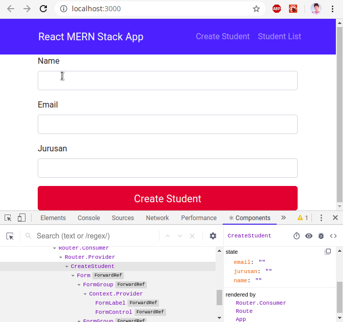

Melanjutkan dari latihan sebelumnya yaitu [Latihan Membuat Aplikasi MERN Part 1](http://me.iqbalpambudi.com/latihan-membuat-mern-part-1). Sebelumnya kita sudah membuat komponen awal dari aplikasi berupa link untuk beralih dari halaman satu ke halaman lain menggunakan `react-router-dom`. Di latihan kali ini kita akan membangun komponen dari `createStudent.js` dan `studentList.js` dan membuat input form.

## Membuat Form Input Student

Buka file `createStudent.js` dan import Form dan Button dari bootstrap
```
import Form from 'react-bootstrap/Form'
import Button from 'react-bootstrap/Button';
```

<br/>Lalu pada method `render()` ubah menjadi seperti ini:

```
render() {
    return (<div className="form-wrapper">
      <Form>
        <Form.Group controlId="Name">
          <Form.Label>Name</Form.Label>
          <Form.Control type="text"/>
        </Form.Group>

        <Form.Group controlId="Email">
          <Form.Label>Email</Form.Label>
          <Form.Control type="email"/>
        </Form.Group>

        <Form.Group controlId="Jurusan">
          <Form.Label>Jurusan</Form.Label>
          <Form.Control type="text"/>
        </Form.Group>

        <Button variant="danger" size="lg" block="block" type="submit">
          Create Student
        </Button>
      </Form>
    </div>);
  }
```

### Membuat Constuctor
Buat sebuah constructor dan letakkan didalam class CreateStudent

```
constructor(props) {
  super(props)

  this.state = {
    name: '',
    email: '',
    jurusan: ''
  }
}
```
<br/>Didalam constructor kita akan mendefinisikan `state` name,email, dan jurusan. State ini digunakan untuk menampung sebuah data. 

### Membuat Form Handling
Kita akan membuat sebuah method yang akan menangani input form. Buat sebuah arrow function dengan nama `onChangeStudentName` dan letakkan dibawah constructor :
```
onChangeStudentName = (e) => {
    this.setState({ name: e.target.value })
  }
```
<br/>Method tersebut berfungsi untuk menangani perbahan value yang ada pada form. Jadi ketika sebuah form diisi sebuah value maka otomatis `state name` akan berisi sesuai value pada form.

Buat juga untuk form email
```
onChangeStudentEmail = (e) => {
    this.setState({ email: e.target.value })
  }
```
<br/>Lalu Jurusan
```
onChangeStudentJurusan = (e) => {
    this.setState({ jurusan: e.target.value })
  }
```
<br/>Kemudian kita akan membuat method untuk menangani Submit.

```
onSubmit = (e) => {
    e.preventDefault()

    const studentObject = {
      name: this.state.name,
      email: this.state.email,
      jurusan: this.state.jurusan
    };

    this.setState({ name: '', email: '', jurusan: '' })
  }
```
> `preventDefault()` berfungsi untuk mencegah halaman reload ketika tombol submit ditekan. 

Disitu kita membuat sebuah objek yang bernama studentObject yang memiliki key name yang berasal dari `state name`, email dan jurusan. Setelah itu kita mengembalikan state ke kondisi kosong seperti semula

Sekarang kita tambahkan atribut `onSubmit` yang berfungsi untuk mentrigger event ketika di lakukan action submit. Pada `<Form>` tambakan atribut `onSubmit` dan buat seperi berikut
```
<Form onSubmit={this.onSubmit}>
```
<br/>Lalu tambahkan juga atribut  `onChange` untuk mentrigger sebuah event ketika terjadi perubahan pada value. Tambahkan juga atribut `value` untuk menampung sebuah value pada `<Form.Control>`. Form Name:

```
<Form.Group controlId="Name">
  <Form.Label>Name</Form.Label>
    <Form.Control type="text" value={this.state.name} onChange={this.onChangeStudentName} />
</Form.Group>
```

<br/>Form Email:

```
<Form.Group controlId="Email">
  <Form.Label>Email</Form.Label>
    <Form.Control type="email" value={this.state.email} onChange={this.onChangeStudentEmail} />
</Form.Group>
```
<br/>Form Jurusan:

```
<Form.Group controlId="Jurusan">
  <Form.Label>Jurusan</Form.Label>
    <Form.Control type="text" value={this.state.jurusan} onChange={this.onChangeStudentJurusan} />
</Form.Group>
```

<br/>Sekarang simpan dan jalankan development server dengan `npm start`. Bila berhasil maka state akan berubah sesuai isi dari input form


<center><small>Fig 1: Form Handling</small></center>

> Pasang ekstensi React Developer Tool pada Chrome Web Store
