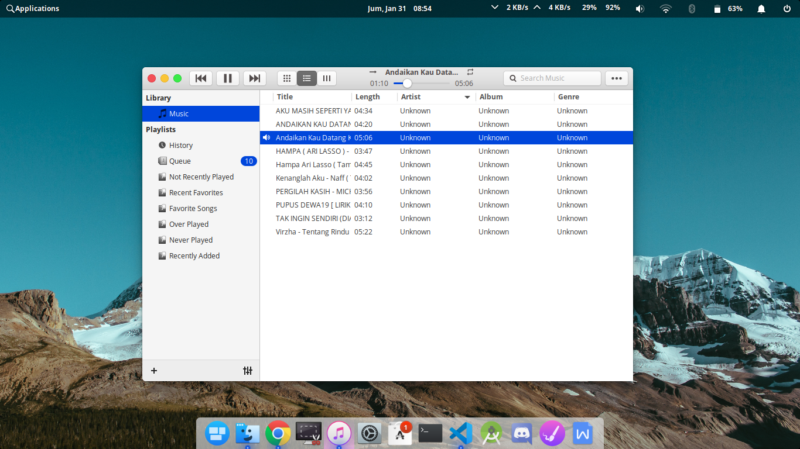
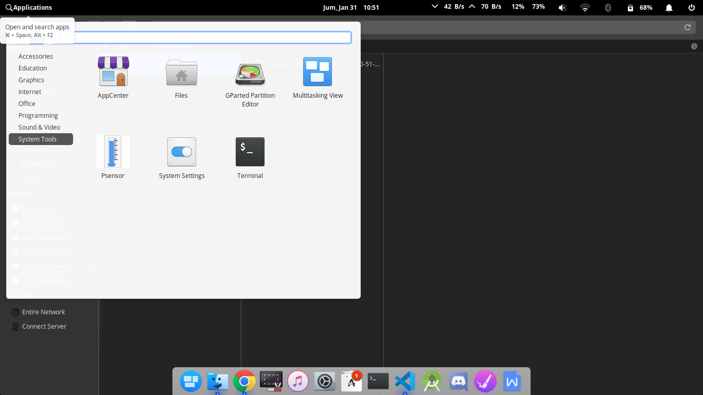
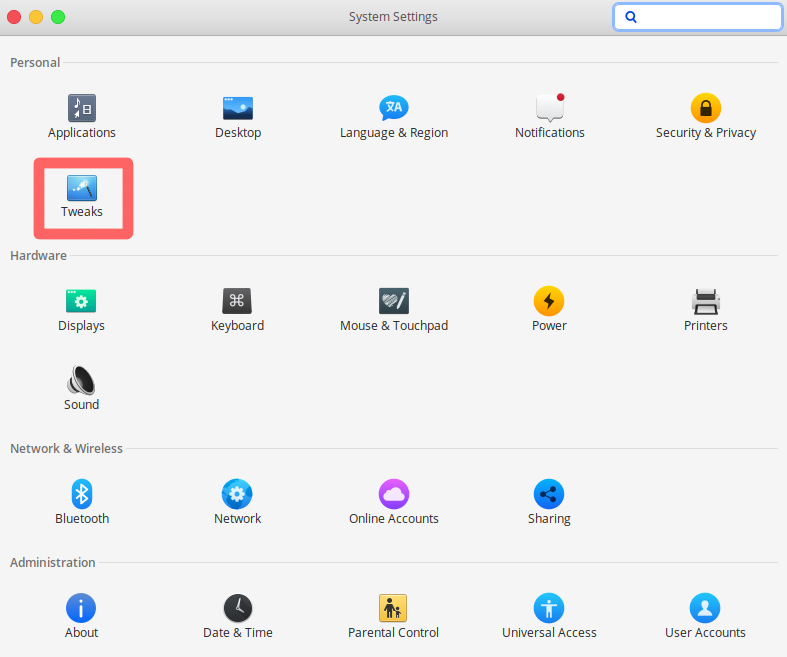
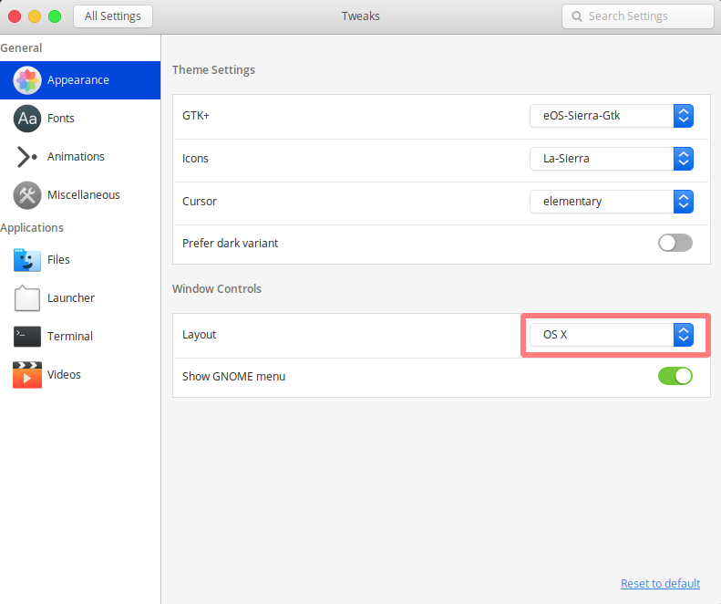

Ini sedikit customisasi pada linux saya, biar mirip sama macOS 🤣. Sudah setahun saya pake Elementary OS yang sekarang sudah versi 5.1 dengan codename _Hera_.

Saya pake ni distro karena tampilannya gan, mirip-mirip sama macOS 🤣, walaupun gak mirip banget sih tapi okelah. Selain itu ni distro juga turunannya ubuntu, jadi aplikasi dan tutorial juga melimpah.

Jadi ceritanya saya nemu artikel tentang kustomisasi Elementay OS biar kayak macOS. Penasaran kan, terus saya ikuti dan beginilah jadinya.

## Screenshot

<br/>


Buat kamu yang mau kustomisasi biar kayak macOS ni yang saya pakai.

## Icon
Ini opsional, kalo nggak mau pasang lewati saja langkah ini. Yang mau masang download dulu
```
$ git clone https://github.com/btd1337/La-Sierra-Icon-Theme ~/.icons/La-Sierra
```

Set icon dengan
```
$ gsettings set org.gnome.desktop.interface icon-theme "La-Sierra"
```

## Tema 
Ini yang utama, download dulu
```
$ git clone https://github.com/btd1337/eOS-Sierra-Gtk ~/.themes/eOS-Sierra-Gtk
```

Pasang tema
```
$ gsettings set org.gnome.desktop.interface gtk-theme 'eOS-Sierra-Gtk'
```

Ini aja udah cukup sih, tapi biar makin jos kita perlu sedikit sentuhan terakhir 🤣.

### Elementary Tweak Tool
Karena posisi tombol maximize berada disebelah kanan, maka kita ubah dulu biar disebelah kiri dan menambahkan tombol minimize yang sebelumnya tidak ada.
```
$ sudo apt install software-properties-common
```
```
$ sudo add-apt-repository ppa:philip.scott/elementary-tweaks
```
```
$ sudo apt install elementary-tweaks
```

<br/>
Nah sekarang  buka system settings dan kamu akan menemukan menu baru seperti ini


<br/>
Klik tweak dan tampilannya akan seperti dibawah ini


Pada Window Control ubah layout menjadi OS X atau terserah kalian. untuk menerapkan dark mode aktifkan Prefer dark variant. Happy tweaking!:D.