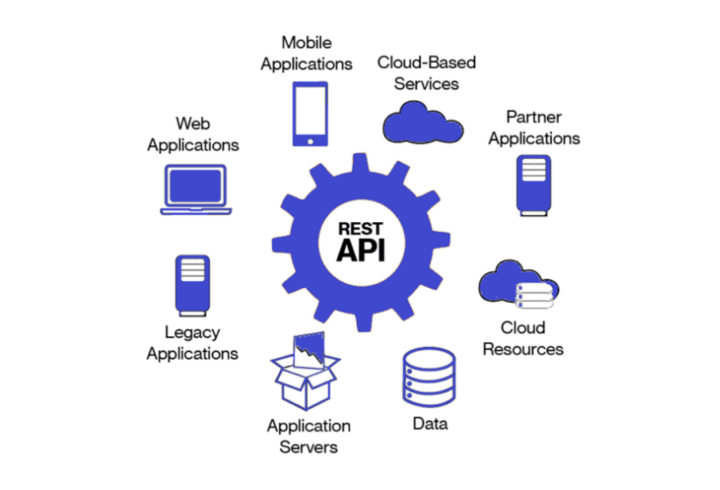
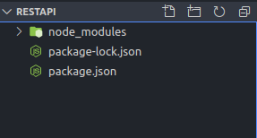
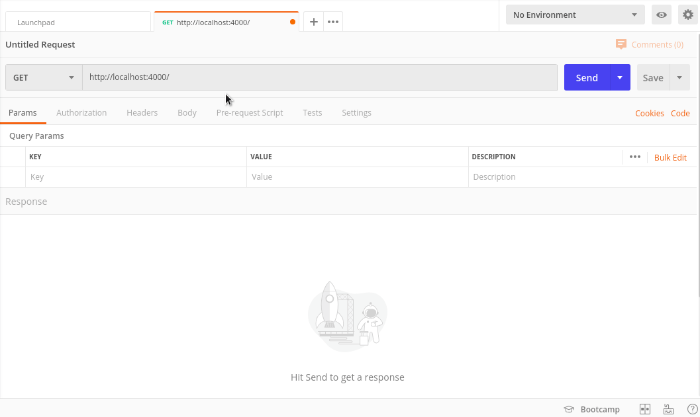
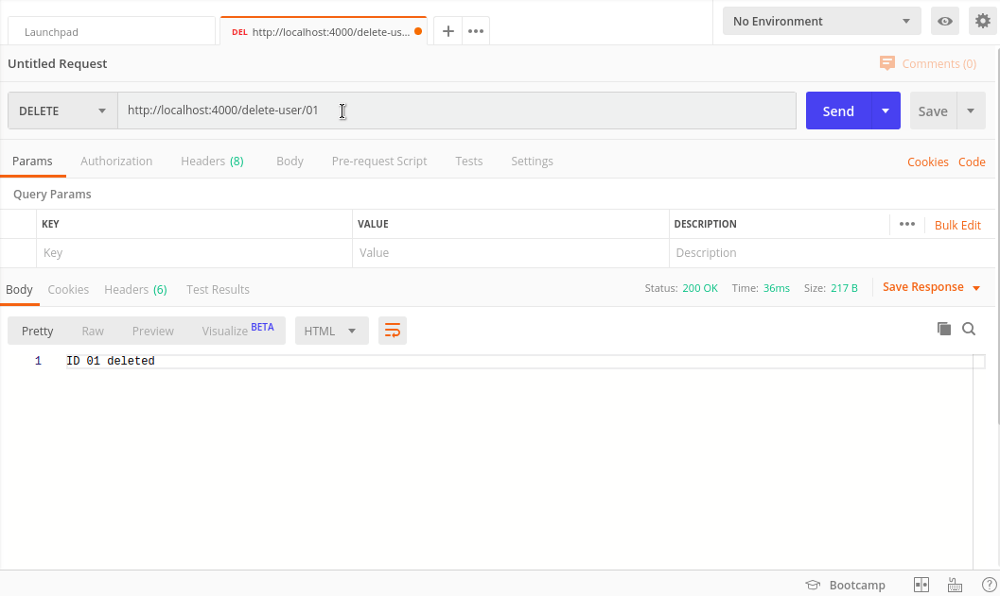
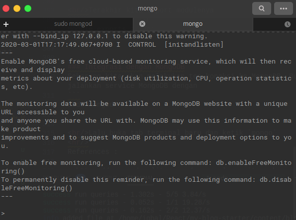
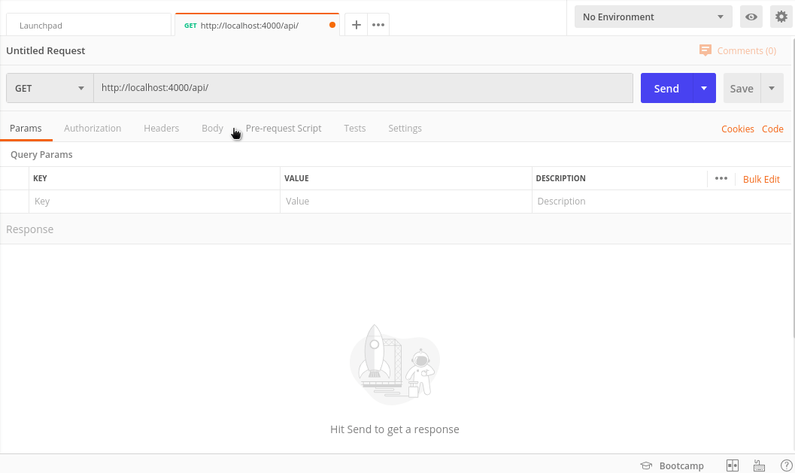
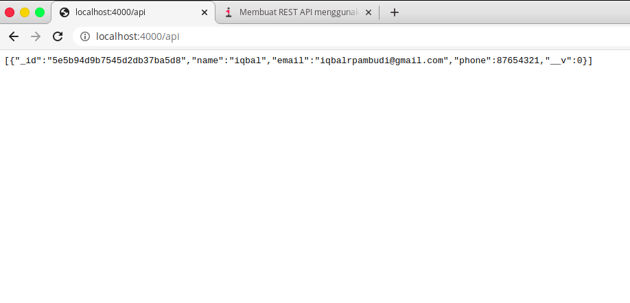

REST API adalah gabungan dari kata **REST** (_Representional State Transfer_) dan **API** (_Application Programming Interface_). Sedangkan pengertian dari REST API itu sendiri adalah sebuah arsitektur dalam sebuah komunikasi yang menggunakan protokol HTTP untuk melakukan pertukaran data.

Arsitektur REST dipilih karena penggunaan REST dirasa lebih mudah dipahami daripada arsitektur lain seperti SOAP (Simple Object Access Protocol). Selain itu keunggulan lain dari REST adalah mudah untuk dikembangkan (scalable) dan memiliki performa yang baik.

Dengan REST API kita dapat membuat sebuah web service yang dapat kita integrasikan dengan berbagai platform mulai dari Web, Mobile, IoT, Cloud dll. Dengan begitu kita dapat saling bertukar data antar berbagai macam aplikasi dan platform lain. Itu dikarenakan REST API menggunakan format data JSON yang didukung oleh hampir semua bahasa pemrograman.


<center><small>Fig 1: REST API</small></center>

## Komponen REST API

- URL Design
- HTTP Verb
- HTTP Response Code 
- Format Response

### URL Design
URL Design adalah struktur URL pada REST API. REST API menggunakan URL atau biasa disebut _endpoint_ untuk melakukan komunikasi data. Struktur URL yang baik dan konsisten akan menghasilkan API yang baik dan mudah dimengerti. Contoh URL/endpoint :
```
/mahasiswa
/mahasiswa/nim
/mahasiswa/nim/edit
```

### HTTP Verbs
Selain melalui endpoint untuk melakukan komunikasi data, kita memerlukan HTTP Verbs agar server mengerti apa yang kita request. HTTP Verbs adalah jenis request yang kita minta ke server apakah itu READ, UPDATE atau DELETE. Dalam HTTP Verbs terdapat beberapa HTTP Verbs yang sering digunakan antara lain :

#### 1. GET<br/>
GET adalah method paling simpel karena GET berfungsi untuk membaca sebuah data. Bila diibaratkan query ini seperti query SELECT pada SQL. Contoh method GET :
```
GET /mahasiswa : mendapatkan data mahasiswa
GET /mahasiswa/1234 : mendapatkan data mahasiswa dengan ID 1234
```

#### 2. POST
POST adalah method untuk melakukan penambahan data baru. Ini seperti query INSERT pada SQL. Contoh method POST :
```
POST /mahasiswa : menambahkan data mahasiswa baru
```

#### 3. PUT
PUT digunakan untuk melakukan perubahan data atau update data. Ini mirip query UPDATE pada SQL
```
PUT /mahasiswa/1234 : merubah data mahasiswa dengan ID 1234
```

#### 4. DELETE
DELETE digunakan untuk menhapus data :
```
DELETE /mahasiswa/1234 : menghapus data mahasiswa dengan ID 1234
```

### HTTP Response Code
HTTP Response Code adalah kode yang menunjukan status hasil request ke client. Beberapa response code
- **2xx** : response code yang menampilkan bahwa request berhasil.
- 4xx : response code yang menampilkan bahwa request mengalami kesalahan pada sisi client.
- 5xx : response code yang menampilkan bahwa request mengalami kesalahan pada sisi server.
> 

### Format Response
Format response adalah format data yang dikirimkan ke client apakah dalam bentuk JSON atau XML. Dengan memberikan format yang sesuai user dapat mengolahnya sesuai kebutuhan.

Contoh format JSON :
```
GET /users/1234
HTTP/1.1 200 OK
Content-Type: application/vnd.api+json

{
“id”: “1234”,
“name”: “jhon”,
“created”: “2015–05–22T14:56:29.000Z”,
“updated”: “2015–05–22T14:56:29.000Z”
}
```


Contoh format XML :
```
HTTP/1.1 200 OK
Date: Sat, 13 Oct 2018 23:20:04 GMT
Server: Apache.1.3.12 (Unix)
Connection: close
Content-Type: text/xml
Content-Length: 124
<?xml version=”1.0″?>
<methodResponse>
<params>
<param>
<value><double>18.24668429131</double></value>
</param>
</params>
</methodResponse>
```


## Membangun REST API
Oke setelah mengetahui tentang apa itu REST API maka sekarang kita akan lanjut ke pembuatan REST API. Sebelum itu pastikan terlebih dahulu kalian sudah menginstall NodeJS+NPM. Disini kita akan mencoba membuat sebuah REST API sederhana berupa CRUD data mahasiswa. 

### Setup Project
>Pastikan PC/Laptop kalian sudah terinstall NodeJS+NPM, MongoDB dan Postman.

Buat sebuah folder dengan nama `restapi` dan masuk ke folder tersebut. Kita akan menginstall beberapa module :

- Express : Framework NodeJS
- Body Parser : Middleware untuk parsing data
- CORS : Middleware
- Mongoose : driver MongoDB

```
npm install express
npm install body-parser
npm install cors
npm install mongoose
```
Jangan lupa jalankan `npm init` untuk menginisiasikan project kalian dan menghasilkan `package.json` dan bila sudah menginstall module diatas maka `package.json` akan terlihat sebagai berikut
```
{
  "name": "restapi",
  "version": "1.0.0",
  "description": "",
  "main": "index.js",
  "dependencies": {
    "body-parser": "^1.19.0",
    "cors": "^2.8.5",
    "express": "^4.17.1",
    "mongoose": "^5.9.2"
  },
  "devDependencies": {},
  "scripts": {
    "test": "echo \"Error: no test specified\" && exit 1"
  },
  "author": "",
  "license": "ISC"
}
```

<center><small>Fig 2: Struktur Project</small></center>


### Basic REST API
Buat sebuah file dengan nama `server.js` dan tambahkan kode berikut untuk mendefinisikan Express:

```
const express = require('express');
const app = express()
```

Lalu kita akan membuat simple route untuk menangani HTTP method yaitu GET, POST, PUT dan DELETE. Tambahkan kode berikut dibaris selanjutnya :

```
//Method GET
app.get('/',(req,res)=>{
  res.send('Hello from GET');
})

//Method POST
app.post('/user',(req,res)=>{
  res.send('Data Inserted');
})

//Method PUT
app.put('/update-user/:id',(req,res)=>{
  res.send('ID ' + req.params.id + ' updated');
})

//Method DELETE
app.delete('/delete-user/:id',(req,res)=>{
  res.send('ID ' + req.params.id + ' deleted');
})
```

Lalu kita akan menjalankan server NodeJS pada port 4000. Maka tambahkan kode berikut :

```
const port = 4000

app.listen(port, () => {
  console.log('Connected to port ' + port)
})
```

Sekarang untuk mengetes simpel REST API kita jalankan `node server.js` pada terminal. Untuk melakukan test pada API kita akan menggunakan Postman. Bila berhasil maka REST API akan menghasilkan response seperti berikut :


<center><small>Fig 3: Testing API dengan Postman</small></center>


<br/>Kalau gagal maka akan seperti berikut :

<center><small>Fig 4: Gagal melakukan request</small></center>

Okey, kita sudah berhasil membuat basic REST API dengan 4 HTTP Method. Sekarang kita akan mengintegrasikannya dengan MongoDB untuk melakukan CRUD data.

### Membuat Model Data
Untuk melakukan operasi CRUD, MongoDB memerlukan sebuah data model. Data model ini bertanggung jawab untuk membuat dan membaca sebuah dokumen dari database MongoDB. 

Kita akan membuat sebuah Schema model terlebih dahulu. Buat sebuah folder dengan nama `model` dan buat sebuah file dalam folder tersebut dengan nama `modelUser.js` lalu isikan kode berikut :
```
const mongoose = require('mongoose');
const Schema = mongoose.Schema;

let userSchema = new Schema(
  {
    name: {
      type: String
    },
    email: {
      type: String
    },
    phone: {
      type: Number
    }
  },
  {
    collection: "users"
  }
);

module.exports = mongoose.model("Users", userSchema);
```
Kode diatas kita akan membuat sebuah collection pada database dengan struktur seperti diatas yang terdiri dari `name` `email` dan `phone`.

### Membuat Route
Route mengacu pada bagaimana sebuah endpoint merespon request dari client. Kita akan membuat sebuah module routing untuk menangani request client pada endpoint. 

Buat sebuah folder dengan nama `route` dan buat sebuah file didalamnya dengan nama `route.js`. Import module express, express router & mongoose :
```
const express = require('express')
const router = express.Router()
```

<br/>Lalu kita import model yang telah kita buat tadi
```
const userSchema = require('../model/modelUser');
```

<br/>Sekarang kita akan membuat route untuk method GET
```
router.route('/').get((req, res) => {
  userSchema.find((error, data) => {
    if (error) {
      return next(error)
    } else {
      res.json(data)
    }
  })
})
```

<br/>Lalu tambahkan route untuk method POST

```
router.route('/user').post((req, res, next) => {
  userSchema.create(req.body, (error, data) => {
    if (error) {
      return next(error)
    } else {
      res.json(data)
    }
  })
});
```
<br/>Route untuk PUT
```
router.route('/update-user/:id').put((req, res, next) => {
  userSchema.findByIdAndUpdate(req.params.id, {
    $set: req.body
  }, (error, data) => {
    if (error) {
      return next(error);
      console.log(error)
    } else {
      res.json(data)
      console.log('User updated successfully !')
    }
  })
})
```

<br/>Yang terakhir method DELETE
```
router.route('/delete-user/:id').delete((req, res, next) => {
  userSchema.findByIdAndRemove(req.params.id, (error, data) => {
    if (error) {
      return next(error);
    } else {
      res.status(200).json({
        msg: data
      })
    }
  })
})
```

<br/>Terakhir kita export modulenya
```
module.exports = router;
```


### Koneksi dengan MongoDB Shell
Sekarang kita akan melakukan tes koneksi ke MongoDB Shell. Buka terminal dan jalankan service MongoDB dengan
```
sudo mongod
```

<br/>Lalu buka tab terminal baru dan ketik `mongo` dan bila berhasil terkoneksi akan seperti ini


<center><small>Fig 4: MongoDB Shell</small></center>


### Merakit Module REST API
Sekarang tahap terakhir adalah menggabungkan beberapa module yang sudah kita buat dan install tadi menjadi satu di file `server.js`. Buka file `server.js` dan import module berikut :
```
const express = require('express');
const mongoose = require('mongoose');
const cors = require('cors');
const bodyParser = require('body-parser');
```
<br/>Buat sebuah variabel untuk menampung koneksi MongoDB
```
const MONGODB_URI = 'mongodb://localhost:27017/restapi'
```

<br/>Lalu kita akan import module route yang sudah kita buat tadi ke sebuah variabel
```
const userRoute = require('./route/route.js')
```

<br/>Sekarang kita akan mengkoneksikan MongoDB kita dengan kode berikut
```
mongoose.Promise = global.Promise;
mongoose.connect(MONGODB_URI, {
  useNewUrlParser: true
}).then(() => {
  console.log('Database sucessfully connected!')
},
  error => {
    console.log('Could not connect to database : ' + error)
  }
)
```

<br/>Okey, sekarang kita akan mendefinisikan express kita dan menggunakan module body parser, cors, dan userRoute yang sudah kita import tadi

```
const app = express();

app.use(bodyParser.json());
app.use(bodyParser.urlencoded({
  extended: true
}));
app.use(cors());
app.use('/api', userRoute)
```

>Kode diatas kita akan menggunakan endpoint /api sebagai root endpoint kita. Bila tidak ingin ada /api maka hilangkan saja. 

Jangan lupa tambahkan pesan 404 ketika tidak ditemukan route atau error

```
app.use((req, res, next) => {
  next(createError(404));
});

app.use(function (err, req, res, next) {
  console.error(err.message);
  if (!err.statusCode) err.statusCode = 500;
  res.status(err.statusCode).send(err.message);
});
```

<br/>Terakhir kita akan menjalankan server kita pada port 4000
```
const port = process.env.PORT || 4000;
const server = app.listen(port, () => {
  console.log('Connected to port ' + port)
})
```
<br/>Jalankan `server.js` kita dengan `node server.js`. Sekarang coba lakukan insert data melalui endpoint `/api/users` menggunakan Postman. Bila berhasil akan terlihat seperti berikut :


<center><small>Fig 5: POST Method with Postman</small></center>

<br/>Untuk melihat response dengan GET bisa dilakukan di browser langsung lewat endpoint `/api` karena secara default browser akan mengirimkan HTTP Request dengan method GET


<center><small>Fig 6: GET Method in browser</small></center>

<br/>Untuk method update dan delete bisa dicoba sendiri :). Yey kita sudah berhasil membuat REST API 🎉.Untuk source code bisa dilihat di [Github](https://github.com/iqbalrpambudi/rest-api). Semoga bermanfaat and happy coding :)
<hr/>
References :

- https://www.codepolitan.com/mengenal-apa-itu-web-api-5a0c2855799c8
- https://medium.com/@fahmiprasetiiio/mengenal-restful-api-menggunakan-flask-part-01-3196a01559fb
- https://mongoosejs.com/docs/models.html
